# Character Art Direction

*This document is a work in progress. Character-specific direction has been started for Cole, with the remaining characters to follow. If anything is unclear or you feel more context or examples would help, please ask and I'll expand on it.*

*The document is split into two sections: **Portrait Style** covers how characters should look in all art outside of active gameplay — card art, UI, splash screens, menus, etc. This is where expressiveness, personality, and detail live. **In-Game Combat Style** covers how characters are rendered as units during battle. The reason for having two distinct approaches is that portrait-level detail and realistic proportions don't translate well to a gameplay context — characters appear small on screen, and the style needs to fit cohesively alongside the environment and creatures rather than looking out of place. A simpler, more stylized in-game style feels like the right solution, but I'm open to thoughts or alternative approaches on this.*

---

## Portrait Style

This covers character art for everything outside of active gameplay — card art, UI, splash screens, menus, etc.

### General Principles

**Design Philosophy**

*Characters should feel expressive and defined — their personality immediately readable from how they carry themselves. That personality comes through facial expression, pose, hair, and clothing — not through inherent physical features or exaggerated proportions. Designing the other way risks characters feeling like caricatures: gimmicky, hard to take seriously, and impossible to find cool.*

- All characters read as approximately 22 years old
- All characters should be conventionally attractive / pretty
- All characters should be fit
- Clothing style: flowy, robe-like silhouettes

> **Note:** I will be taking the time to develop a more detailed and consistent clothing style. Any clothing references or notes in this doc for now are cursory thoughts in the meantime.

Character art inspiration board: [Pinterest](https://www.pinterest.com/amarichar/character-art-inspo/)

---

### Positive References

**[Ichi the Witch](https://www.viz.com/ichi-the-witch)**

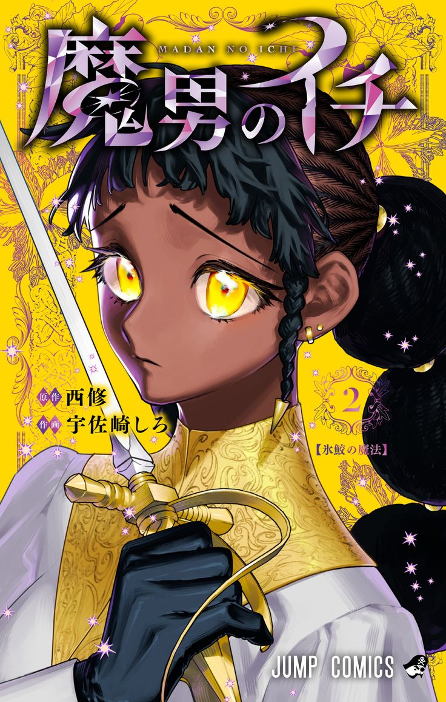 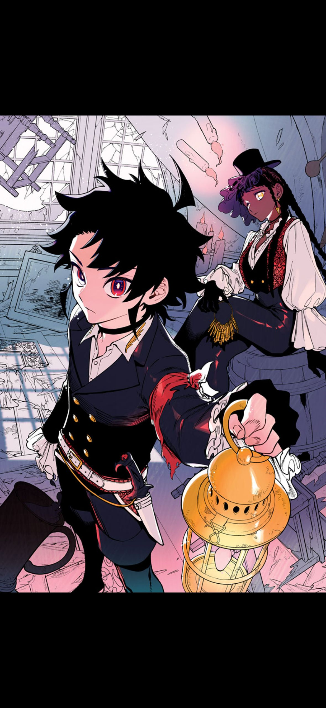

*Left: Desscaras | Right: Ichi & Desscaras (cover art)*

- **Desscaras (left):** Desscaras is stylish and expressive. The slight downturn of her eyes and mouth conveys emotion without being dramatic about it.
- Strong example of depicting a POC without caricaturizing them.
- **Cover art (right):** Ichi reads as confident and composed through his facial expression and posture.

---

**John Kafka — [@john_kafka02](https://x.com/john_kafka02)**

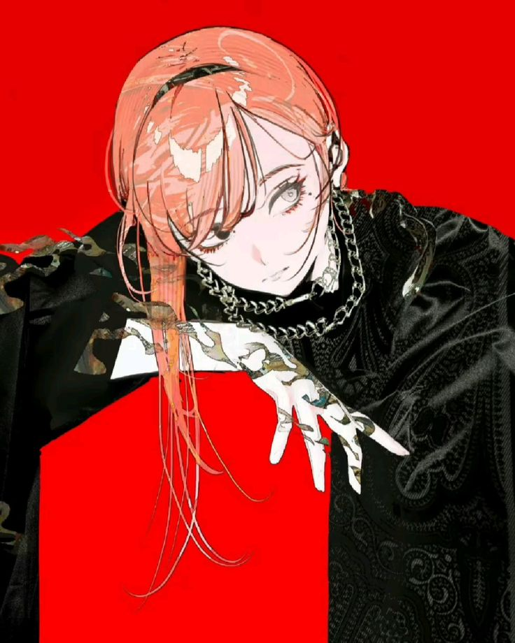 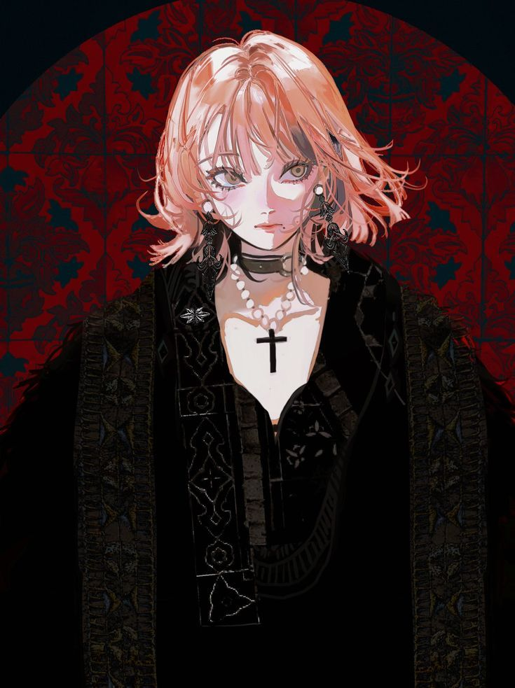 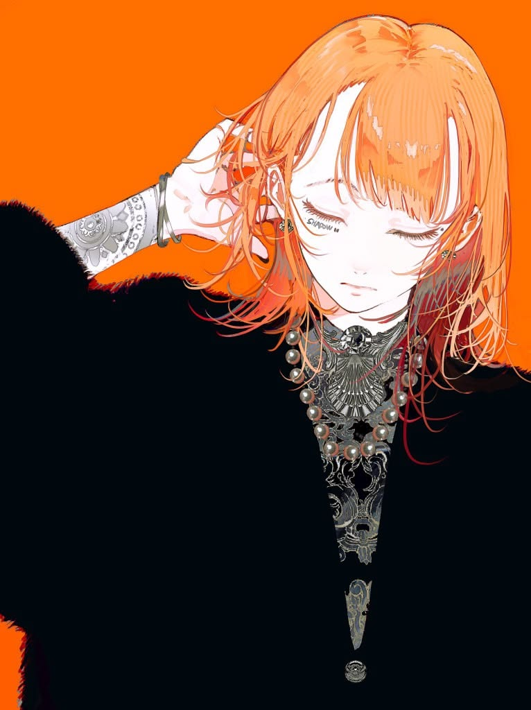

Three images of the same character. Her jewelry and clothing are elaborate and deliberate — she clearly has a strong sense of style and personal taste. But her expression and posture are completely nonchalant. In the first she is lying down, her posture relaxed and at ease. In the second, her hair is mid-movement but her body is completely still — she seems calm and unbothered. In the third her eyes are closed, hand casually in her hair, entirely unconcerned. That contrast between obvious style and zero effort in her demeanor is what makes her read as effortlessly cool. This specific art style probably wouldn't translate directly to a game context, but that quality — a character whose personality comes through without them needing to announce it — is exactly what we're aiming for.

---

### Negative References

The following are examples of art directions that have elements that don't align with what we're going for, and why.

**[Clash Royale](https://supercell.com/en/games/clashroyale/) — personality through proportions**

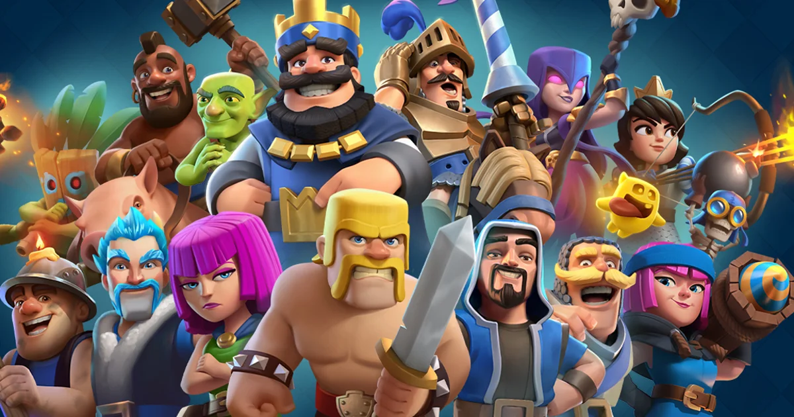

Personality should come through facial expression, pose, hair, and clothing — not body proportions. In Clash Royale there is a direct correlation between how exaggerated a character's proportions are and how unserious they read. The Barbarian is massive with tiny legs and a gap tooth — his build makes him a dumb brute before he's done anything. PEKKA is a hulking mass, its size *is* its personality. The Princess is normally proportioned and reads as composed and intelligent by comparison. Exaggerated proportions carry an inherent silliness that undercuts cool. Our characters should feel serious and grounded — personality conveyed through how they carry themselves, not how big they are.

---

**[Skullgirls](https://skullgirls.com/) — art style too soft to read as serious**

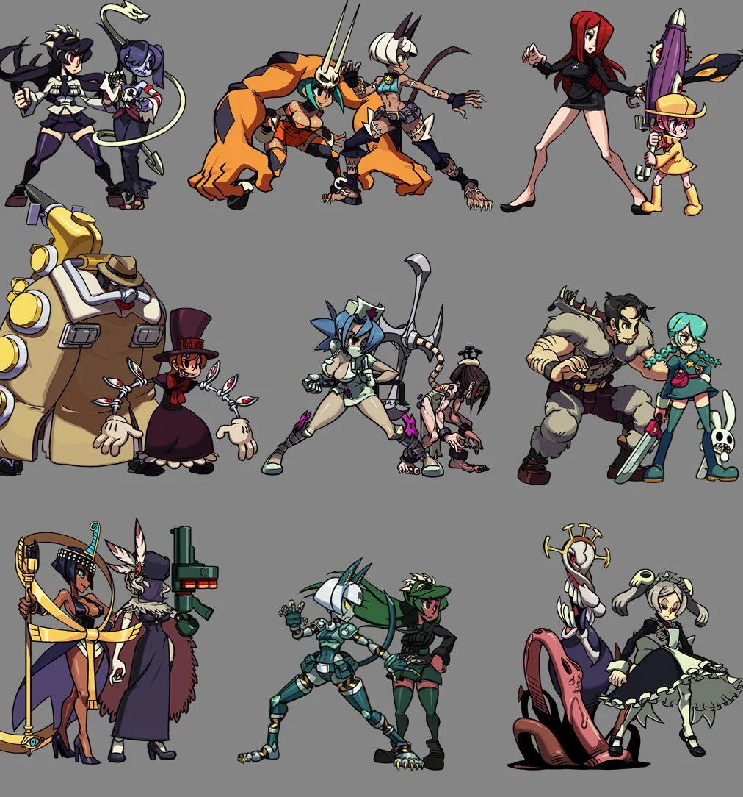 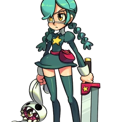

Everything is rounded, smooth, and cute in a way that defuses any edge or coolness. Even characters that are supposed to feel dangerous or intense get undercut by the softness of the art style — there's no visual tension. The characters end up feeling like they belong in a Saturday morning cartoon regardless of what they're actually doing. Our characters need sharp, deliberate lines that make them feel like someone you'd take seriously. Compare Annie here to Desscaras — the difference in how seriously you take each of them is almost entirely down to that.

---

## In-Game Combat Style

This covers the characters as they appear during active battles — the units that attack and get hit.

The current best candidate is a style similar to the characters from *Sword x Staff* — a chibi-adjacent proportion style. Chibi-adjacent works here because the simplified proportions are immediately readable at a small scale, and the style is flexible enough to still carry character and personality without requiring portrait-level detail. A fully realistic style at this scale would lose detail and read as muddy, while something too abstract would lose character entirely. Chibi-adjacent sits in between — simplified enough to work at scale, expressive enough to still feel like a person.

> **Note:** Open to feedback on this. If there's a better method that preserves portrait expressiveness while working proportionally in-engine, worth exploring.

### References

**[Sword x Staff](https://www.youtube.com/watch?v=C7s_-a-B-8c)**
- [Short](https://www.youtube.com/shorts/sRPh87GbfHE)
- [Gameplay](https://www.youtube.com/watch?v=C7s_-a-B-8c)
- [Characters focused](https://www.tiktok.com/@sxsmoririn/video/7627502796035640607)

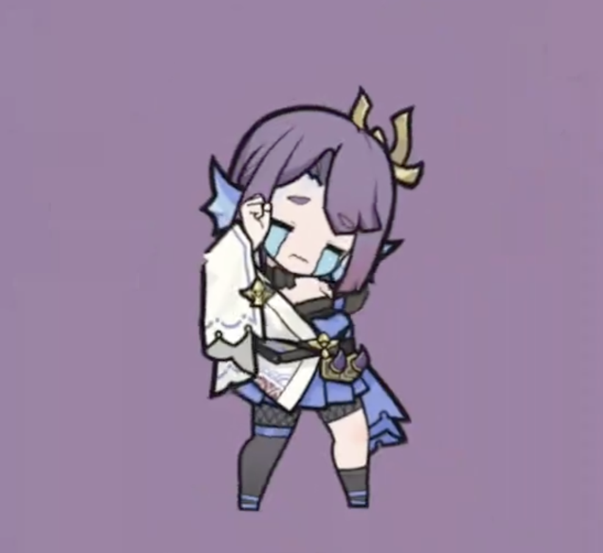

*Example of how characters are rendered in-game*

---

## Character-Specific Direction

---

### Cole

#### Personality & Vibe

Cocky, arrogant, full of himself — but in a cool way. Regal.

#### Primary Inspiration

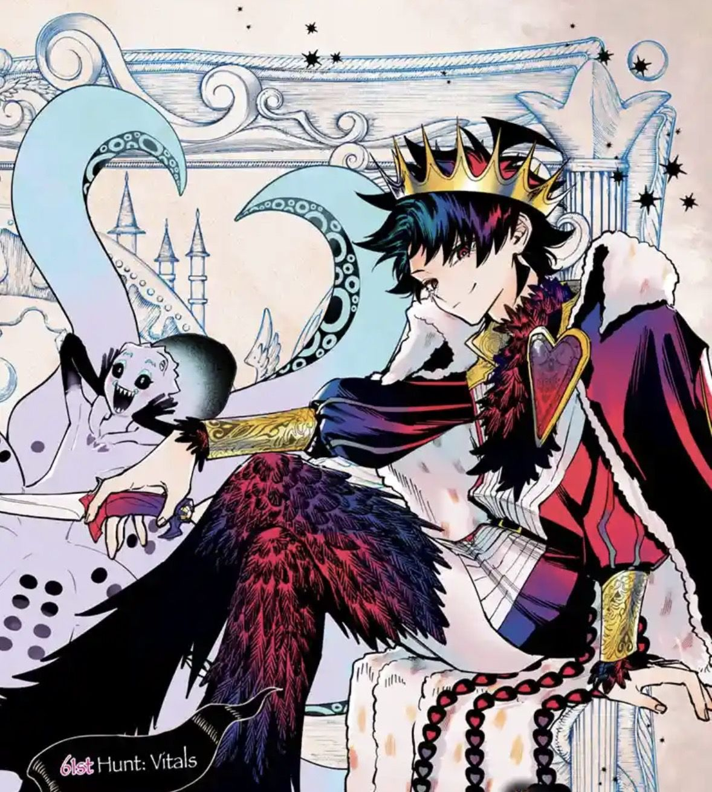

*Primary inspiration — unnamed character*

> **Note:** The primary inspiration captures the personality and aesthetic well, but the character reads younger than intended (~15-16) due to his height/proportions. Cole should read as ~22. The hair ref image below is a better reference for the older age read.

#### Face

 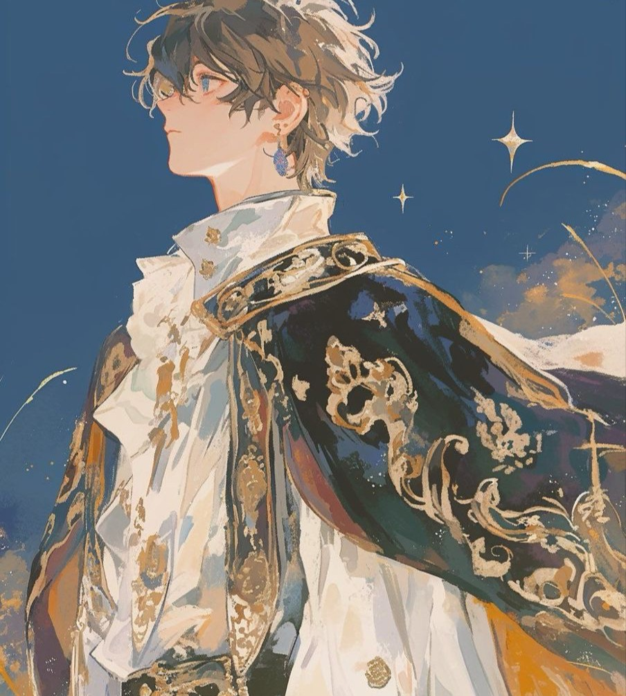

*Left: primary inspiration | Right: hair reference*

Face shape and features: see refs above. Default expression: holier than thou, cocky.

#### Hair

Messy, tousled short hair — effortlessly disheveled. Feels natural and a little wild rather than perfectly styled.

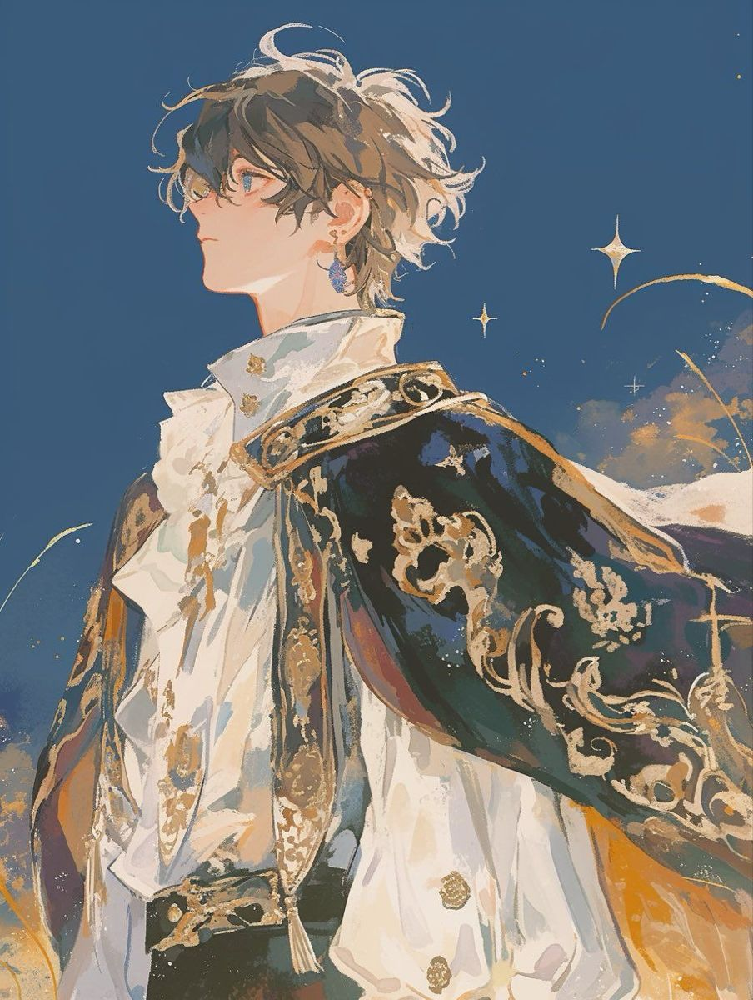

*Hair reference*

#### Body

*(Describe proportions, silhouette, build, pose energy, etc.)*

#### Color

- Skin: Warm ivory — slightly tan, not pale (#e9c7a8)
- Hair: Red

#### Clothing

- Regal, fancy, elegant — not gaudy or tacky
- Gold highlights and/or gold accessories to reinforce his regal quality

---

<!-- Template for adding new characters:

### [Character Name]

#### Personality & Vibe

#### Primary Inspiration

#### Face

#### Hair

#### Body

#### Color

#### Clothing

-->
